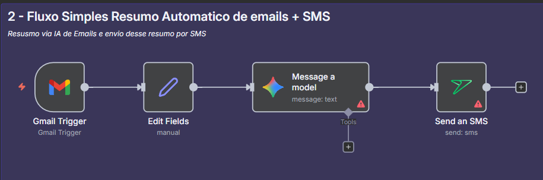

# Alura Carreira Especialista IA [Nível 1]

### Proprosta do Nível
> Chegou a hora de transformar ideias em automações reais. Neste passo, você vai aprender a usar ferramentas como Make, N8N para criar fluxos inteligentes que automatizam desde tarefas simples até integrações com redes sociais. Esse domínio é essencial para especialistas de IA que querem atuar em áreas como marketing, atendimento ou operações.
>
> Além disso, você vai explorar os fundamentos do RAG (Retrieval-Augmented Generation), técnica essencial para criar chatbots e assistentes capazes de buscar informações em bases de dados e responder com contexto. Com esse conjunto de habilidades, você já estará apto(a) a atuar como desenvolvedor(a) júnior de soluções baseadas em IA.

---

## n8n

Este tópico é dedicado para documentar os projetos em aula referente a n8n.
Os arquivos ficarão na pasta `projects/n8n`.

<strong>Case 1: Cotação Monetária para Google Sheets</strong>

**Objetivo:** Consumir uma API de cotação monetária e armazenar os dados em um banco de dados (Google Sheets).

* **API Utilizada:** [AwesomeAPI](https://economia.awesomeapi.com.br/)
* **Destino:** Google Sheets

#### Estrutura do Workflow

`Trigger Click Manual` -> `Requisição HTTPS` -> `Tratamento/Seleção dos Dados` -> `Registro no Google Sheets`

#### Workflow Visual

#### Aprendizados

* A utilizar o nó do Google Sheets no N8N para adicionar dados a uma planilha.
* A configurar o fluxo de autenticação do N8N com o Google Drive via OAuth 2.
* A criar e nomear uma planilha no Google Sheets para integrar dados do workflow.
* A mapear dados do workflow para colunas específicas em uma planilha.
* A configurar um gatilho no N8N que inicia um fluxo ao receber e-mails no Gmail.
* A integrar o N8N com uma API usando o nó HTTP Request para manipulação de dados.
* A extrair e processar informações de e-mails recebidos com o N8N.
* A utilizar um nó de configuração para filtrar e renomear dados extraídos.

<strong>Case 2: Agente IA para Resumo Email + SMS</strong>

**Objetivo:** Receber  o email criar resumir usando IA (Nesse caso Gemini) e enviar esse email via SMS.

